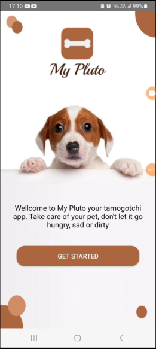
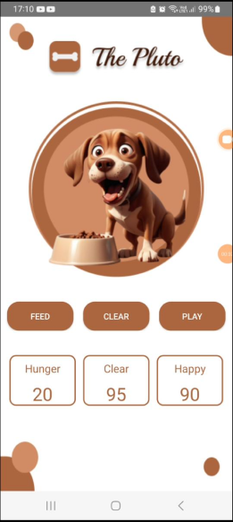
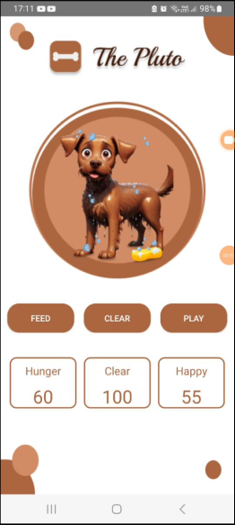
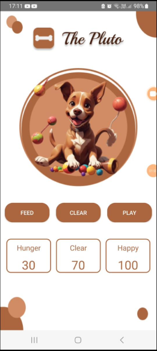

# My Pluto - Pet Care App

My Pluto is a mobile application designed to offer an interactive experience of caring for a virtual pet. This app allows users to take care of a character named Pluto, satisfying his basic needs such as food, cleaning and fun.

## Purpose of the Application

My Pluto main goal is to provide users with a fun and educational experience of caring for a virtual pet. The app aims to teach responsibility, empathy and attention to caring for a pet, while providing entertainment and fun.

## Screenshots

  
_Screenshot 1: Main screen showing Pluto's status and buttons for interaction._

  
_Screenshot 2: Feeding Pluto._

  
_Screenshot 3: Cleaning Pluto._

  
_Screenshot 4: Playing with Pluto._

### 🌐YouTube link

[Go to the youtube "My Pluto - video"](https://www.youtube.com/shorts/TM22RSGOwMw/)
=======
[Go to the youtube "My Pluto - video"](https://www.youtube.com/shorts/TM22RSGOwMw)
>>>>>>> 77f24db47ea8c349bbb7c5b65eded2f90ee15320

## Features

- **Feeding**: Users can feed Pluto to reduce its hunger but also affect its health and cleanliness.
- **Cleaning**: Users can clean Pluto to increase its cleanliness while decreasing its health slightly.
- **Playing**: Users can play with Pluto to increase its happiness and health while also reducing its hunger and cleanliness.

## Usage

- Launch the app to see Pluto's current status.
- Use the buttons (Feed, Clean, Play) to interact with Pluto.
- Monitor Pluto's health, hunger, and cleanliness to keep it happy and healthy.

## Development

This app is developed using Kotlin programming language and Android Studio IDE.

## Design Considerations

PlutoPet's design has been carefully crafted to provide an intuitive and pleasant user experience. Some design considerations include:

- **Friendly Interface**: A user interface is designed to be simple and friendly, making it easier for users to interact with the application.

- **Charming Graphics**: The graphics and animations have been carefully revised to create a captivating and expressive character that users feel like caring for and interacting with.

- **Visual Feedback**: The app provides clear visual feedback for users' actions, such as changes to Pluto's appearance and updates to status meters.

- **Immersive Experience**: Features such as sounds and animations help create an immersive experience, enhancing the feeling of caring for a real pet.

## Uses of GitHub

The GitHub repository for PlutoPet has several uses, including:

1. **Version Control**: GitHub is used to control and manage different versions of the application's source code.

2. **Collaboration**: Developers can easily collaborate on the project, working on different parts of the code and merging their contributions back to the main repository.

3. **Issue Tracking**: GitHub Issues is used to track and resolve application-related issues, bugs, and feature requests.

4. **Documentation**: The README.md and other documents in the repository provide detailed information about the application, its purpose, design, and usage instructions.

5. **Continuous Integration**: Continuous integration tools like GitHub Actions can be adjusted to automate testing and deployments whenever new changes are made to the source code.

## Author

- Jecira Miguel - Developer
- Student number - ST10450462

## License

This project is licensed under the MIT License - see the [LICENSE.md](https://chat.openai.com/c/LICENSE.md) file for more details.
